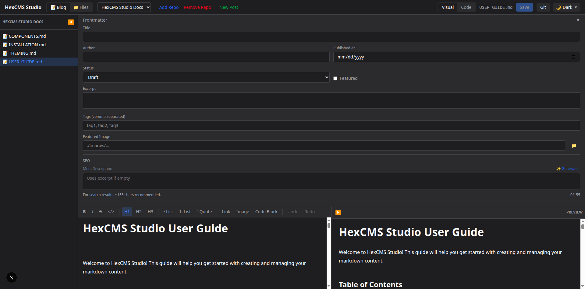

# HexCMS Studio

A modern, themeable markdown CMS editor for managing your content repositories locally. Built with Next.js 16, featuring visual WYSIWYG editing, Git integration, and multi-repository support.

> **Note**: HexCMS Studio is designed to run locally on your machine. It requires direct filesystem access to read and write your content files, and cannot be deployed to cloud platforms like Vercel.



## Features

- **Visual & Code Editing** - Switch between WYSIWYG (TipTap) and raw markdown editing
- **YouTube Embeds** - Paste YouTube URLs directly; auto-converted to responsive embeds
- **Multi-Repository Support** - Connect and manage multiple local Git repositories
- **Frontmatter Editor** - Edit post metadata with a user-friendly form interface
- **Live Preview** - Real-time markdown preview with syntax highlighting
- **Git Integration** - Stage, commit, push, and pull directly from the UI
- **File Browser** - Navigate filesystem to add repositories easily
- **Multi-Theme Support** - Light, Dark, Midnight, and Sepia themes

## Quick Start

### Prerequisites

- Node.js 18+
- Git

### Installation

```bash
# Clone the repository
git clone https://github.com/alamb-hex/hexcms-studio.git
cd hexcms-studio

# Install dependencies
npm install

# Start the editor
npm run dev
```

Open [http://localhost:3000](http://localhost:3000) to start editing.

### Add Your First Repository

1. Click **+ Add Repo** in the header
2. Click **Browse** to navigate to your content folder
3. Optionally set a **Content Path** (e.g., `content`, `docs`, `posts`)
4. Click **Add Repository**

## Documentation

| Document | Description |
|----------|-------------|
| [Installation Guide](docs/INSTALLATION.md) | Detailed setup instructions |
| [User Guide](docs/USER_GUIDE.md) | How to use HexCMS Studio |
| [Theme System](docs/THEMING.md) | Customizing themes |
| [Components](docs/COMPONENTS.md) | Developer documentation |

## Tech Stack

- **Framework**: Next.js 16 (App Router, Turbopack)
- **Styling**: Tailwind CSS v4
- **WYSIWYG Editor**: TipTap
- **Code Editor**: CodeMirror 6
- **Markdown**: marked + DOMPurify
- **Git**: simple-git

## Configuration

Repository settings are stored in `~/.hexcms-studio/config.json`.

Optional environment variables (`.env.local`):

```env
PORT=3000
```

## Why Local Only?

HexCMS Studio needs direct access to your filesystem to:
- Read and write markdown files in your repositories
- Execute Git commands (commit, push, pull)
- Browse directories when adding new repositories

This makes it ideal for local content management but incompatible with serverless deployments.

## License

MIT
